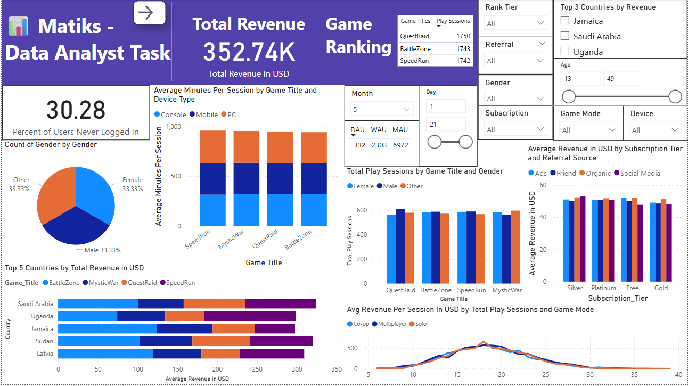
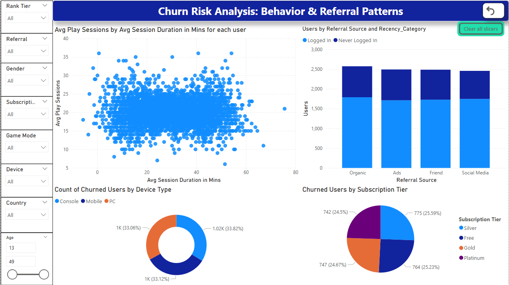

# Matiks User-Level Behavioral and Revenue Data Analysis

This project presents an in-depth analysis of user behavior, revenue trends, and churn patterns for a hypothetical gaming platform, **Matiks**. The goal was to extract actionable insights that could drive engagement, improve retention, and enhance monetization strategies.  

> ⚡ **Context:** I discovered this data analyst task as part of a LinkedIn case study challenge. Although I wasn’t eligible to apply, I took on the task as a personal project to sharpen my analytical skills and demonstrate my ability to turn raw data into strategic recommendations.

---

## 📊 Dashboard Snapshots  

### Revenue Segmentation  

- Showcased revenue patterns by country, subscription tier, and game mode.  
- Revealed that Co-op game mode generated the highest average revenue per session at mid-level play counts (~15-20 sessions).  
- Identified opportunities for premium upsells and targeting mid-engagement users for monetization.

---

### Churn Risk Analysis  

- Identified high-risk user segments with low play sessions and short session durations.  
- Highlighted referral sources and device types contributing uniformly to churn, signaling product-side improvement needs over acquisition channel fixes.

---

## 🔑 Key Insights  

- **Low daily stickiness:** DAU/MAU ratio ~5% → players aren’t forming daily habits.  
- **Revenue drivers:** Co-op mode and mid-level engaged users (10–20 sessions) are the most lucrative segments.  
- **Balanced participation:** Gender, device type, and subscription tiers showed no major skews → retention strategies should be universal, not niche-targeted.  
- **Churn risks:** Early churners often have short session durations and few play sessions, regardless of device, tier, or referral source.

---

## 📝 Recommendations  

✅ Launch daily login streaks, challenges, or rewards to improve DAU/WAU ratios.  
✅ Double down on Co-op and multiplayer game modes through targeted events and promotions.  
✅ Create premium bundles and upsells aimed at mid-level engaged users.  
✅ Implement early intervention campaigns for users with <10 sessions or <15 min average session duration.  
✅ Align referral incentives to actual engagement milestones (not just signups).  

---

## ⚙ Technologies  

- **Power BI:** For dashboard design and visualization  
- **Excel / Data Cleaning:** For initial data preparation  
- **Git & GitHub:** Version control and project management  

---

## 🌟 Why This Project Stands Out  

- Translated raw behavioral and revenue data into **clear business narratives** and **strategic actions**.  
- Designed insights with **stakeholder decision-making in mind**, as would be expected in a real-world analyst role.  
- Took initiative on an open challenge, demonstrating **self-motivation** and **practical data storytelling** skills.  

---

## 📫 Let’s Connect  

If you’re interested in my work or would like to discuss internship opportunities:  

